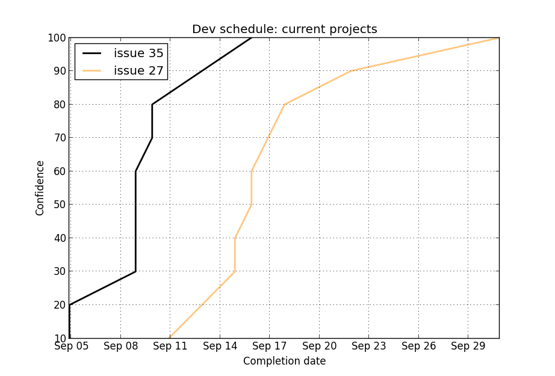

Evidence Based Scheduling
=========================

This is a simple python implementation of `evidence based scheduling`_ (à la
Joel Spolsky).  It generates confidence plots for project completion dates
from a list of task estimates and a set of scheduling rules.

Dependencies
-------------

* numpy
* matplotlib (must be configured w/ interactive backend)
* python-dateutil

Usage
-------

To generate an ebs confidence curve, you must feed `ebs.py` a tasks file
and a schedule rules file.  Invoke as follows::

    ebs.py tasks.csv rules.py

It will run monte-carlo simulations of the uncompleted tasks using
velocities from completed tasks, generate a confidence plot of the results,
and display it with `pyplot.show()`.

Tasks file
""""""""""

The tasks file is a csv file with one entry for each task.  The first row
is assumed to be a header row.  Each entry has the following fields, in
order:

Project
    A separate confidence curve will be plotted for each incomplete
    project, assuming purely sequential effort in the order that they
    appear.

Task
    Individual task description.  This field is ignored.

Estimate
    Individual task estimate in hours.

Actual
    For completed tasks only.  Actual time taken to complete the task, in
    hours.

Rows with no estimate or actual time are ignored.  It is legal to include
tasks with actual completion time and no initial estimate.  These will
contribute to a buffer factor for unanticipated tasks.  Below is an
example::

    project,task,estimate,actual
    ,,,
    issue 35,data query,2,4.1
    issue 35,view/template,2,2.9
    issue 35,plots,1,2.4
    issue 35,js,1,0.2
    issue 35,css,1,3.6
    issue 35,cms integration,4,
    issue 35,deploy,2,
    issue 35,bug fixes,,0.8
    ,,,
    issue 27,spec formulas,0.5,3.6
    issue 27,data query,3,0.3
    issue 27,template,2,4.9
    issue 27,js,4,7.1
    issue 27,form,,1.1
    issue 27,css,2,
    issue 27,adapt offline classes,8,
    issue 27,plots,3.3,

Rules file
""""""""""

The rules file must define `rules` as a list of (*rule*, *anticipated
effort*) tuples, where *rule* is a `dateutil.rrule` instance specifying one
or more calendar days and *anticipated effort* is the number of hours of
work planned on those days.  The rules are processed in order, and the
first match for each day is used::

    from datetime import datetime
    from dateutil.rrule import *

    dtstart = datetime(2015, 9, 4)
    weekdays = rrule(WEEKLY, byweekday=(MO, TU, WE, TH, FR), dtstart=dtstart)
    laborday = rrule(DAILY, dtstart=datetime(2015, 9, 7), count=1)
    offsite_training = rrule(DAILY, dtstart=datetime(2015, 9, 10), count=4)

    rules = [
        (laborday,  0),
        (offsite_training, 3),
        (weekdays,  8),
    ]

With the example inputs, the following plot is obtained:

.. _evidence based scheduling: http://www.joelonsoftware.com/items/2007/10/26.html
